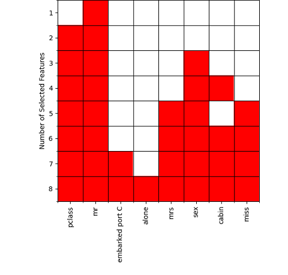

[](
  https://circleci.com/gh/dwave-examples/feature-selection-notebook)

# Feature Selection Jupyter Notebook

This notebook develops a QPU programming model for an optimization problem that
selects a subset and demonstrates it using Ocean software's
[dwave-hybrid](https://docs.ocean.dwavesys.com/en/stable/docs_hybrid/sdk_index.html)
on an example of feature selection for machine learning.

The notebook has the following sections:

1. **What is Feature Selection?** defines and explains the feature-selection problem.
2. **Feature Selection by Mutual Information** describes a particular method of
   feature selection that is demonstrated in this notebook.
3. **Solving Feature Selection on a Quantum Computer** shows how such optimization
   problems can be formulated for solution on a D-Wave quantum computer.
4. **Example Application: Predicting Survival of Titanic Passengers** demonstrates
   the use of *Kerberos*, an out-of-the-box classical-quantum
   [hybrid](https://docs.ocean.dwavesys.com/en/stable/docs_hybrid/sdk_index.html)
   sampler, to select optimal features for a public-domain dataset.

## What is Feature Selection?

Statistical and machine-learning models use sets of input variables ("features")
to predict output variables of interest. Feature selection can be part of the model
design process: selecting from a large set of potential features a highly informative
subset simplifies the model and reduces dimensionality.

For systems with large numbers of potential input information&mdash;for example,
weather forecasting or image recognition&mdash;model complexity and required compute
resources can be daunting. Feature selection can help make such models tractable.

However, optimal feature selection can itself be a hard problem. This example
introduces a powerful method of optimizing feature selection based on a complex
probability calculation. This calculation is submitted for solution to a quantum
computer.



## Installation

You can run this example
[in the Leap IDE](https://ide.dwavesys.io/#https://github.com/dwave-examples/feature-selection-notebook).

Alternatively, install requirements locally (ideally, in a virtual environment):

    pip install -r requirements.txt

## Usage

To enable notebook extensions[^1]:

```bash
jupyter contrib nbextension install --sys-prefix
jupyter nbextension enable toc2/main
jupyter nbextension enable exercise/main
jupyter nbextension enable exercise2/main
jupyter nbextension enable python-markdown/main

```

To run the notebook:

```bash
jupyter notebook
```

[^1]: Leap's IDE, which runs VS Code, does not support all notebook extensions.  

## License

See [LICENSE](LICENSE.md) file.
